# Fans board

开源粉丝面板

购买链接：https://item.taobao.com/item.htm?id=636602441363

Github托管：https://github.com/HelloWorksGroup/FansBoard

Gitee托管：https://gitee.com/xianii/fans-board

## 总览

`Fans board` 开源粉丝面板是一个用于网络数据实时显示的硬件。
它可以用来实时显示粉丝数，播放数，天气，股价等动态变化的信息。

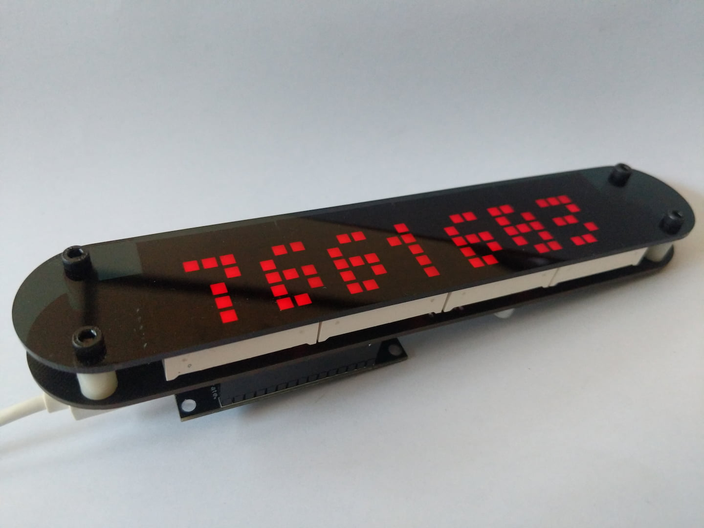

## 使用说明

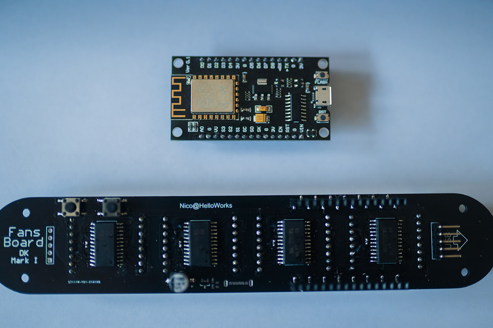

本套装包含一个`nodeMCU v3`模块和一个四联装`8x8`点阵驱动显示板。模块与显示板通过`2.54mm`排针连接。

注意在连接时按照板上丝印提示，模块的USB口应当朝外，否则可能会损坏模块或驱动板。

### 0. 环境准备

`nodeMCU`有不少工具可以用，出于对初学者的友好程度的考虑，这里选择`ESPlorer`这个工具。

`ESPlorer`是一个使用`java`开发的图形界面软件。在支持`java`运行时的环境下都可以运行，所以可以方便的跨平台使用。

#### 安装Java运行时环境
1. Ubuntu: `sudo apt install openjdk-8-jre`
2. Windows: 安装开发包中的`JRE_v8.0.202_windows`

#### 启动软件
1. Ubuntu: `sudo java -jar ESPlorer.jar`
2. Windows: 直接双击`ESPlorer.jar`或者`ESPlorer.bat`打开

确认软件能正常运行后关闭它，我们在下载脚本时才需要用到它。

### 1. 连接设备

将模块按照图示方向USB口朝外缓缓插入插座中。注意模块拔插时尽量保持模块水平，避免弯曲排针或弄断排针导致模块无法使用。

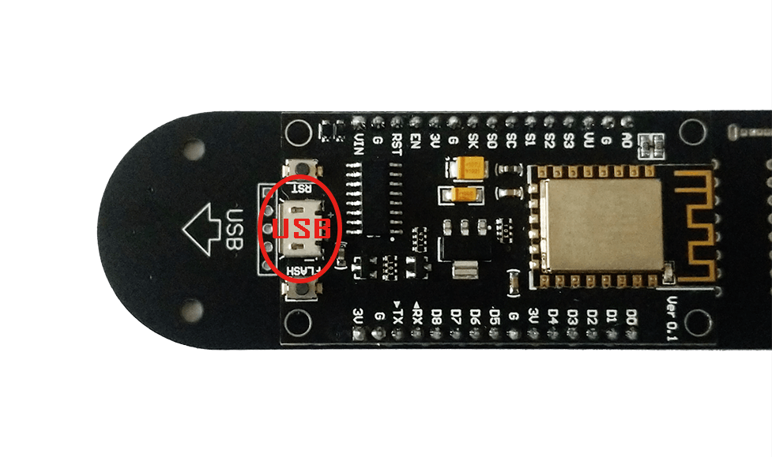

然后使用配套的`microUSB`数据线连接开发套件与电脑。

如果你的系统没有`CH340`的串口驱动，则无法正确识别出设备，在设备管理器中如下图所示：

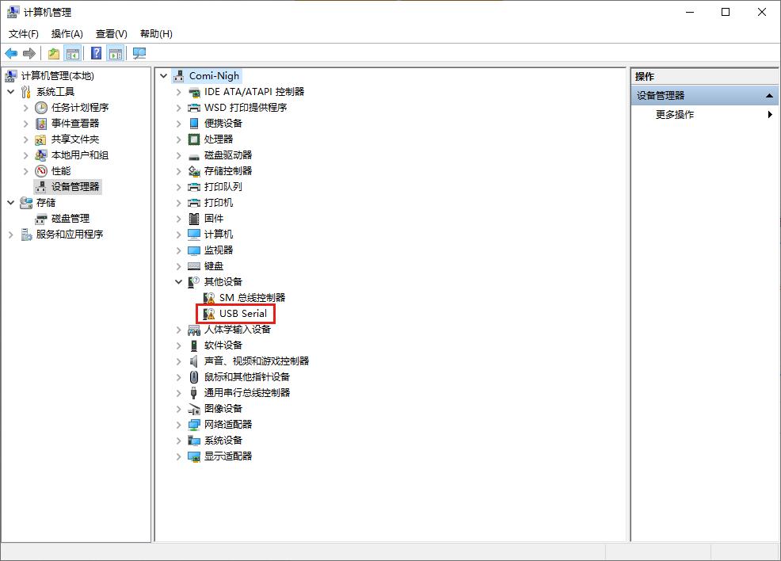

此时，只需要安装开发包中提供的驱动`CH341Setup`即可。安装完成后即可正常识别设备如下：

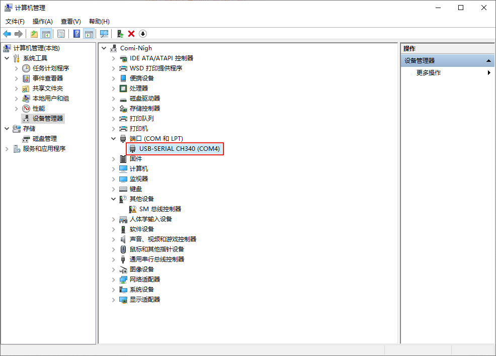

### 2. 烧录固件

我们发货的套件有可能是烧录了配套固件的，也有可能没有烧录，这个根据当时发货采用的流程会有不同。

如果已经烧录了固件，则可以跳过这一步。

常用的固件烧录工具有：

- [pyFlasher](https://github.com/marcelstoer/nodemcu-pyflasher)

- [esptool](https://github.com/espressif/esptool)

在我们的开发包里面包含了前者。此处在windows环境下以前者为例说明烧录固件的方法。

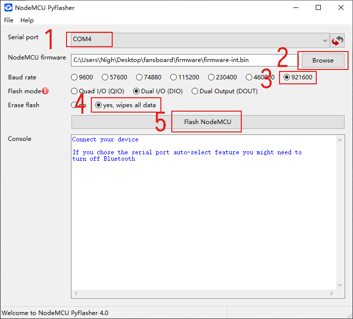

打开`pyFlasher`软件。

1. 选择正确的串口号（第一步在设备管理器中看到的），如果没有其他串口设备，选择自动也可。
2. 浏览选择开发包中包含的固件。
3. 速度选择，没有问题就选择最快的。
4. 选择擦除数据。
5. 点击开始烧录固件。

成功烧录完成则会如下图所示：

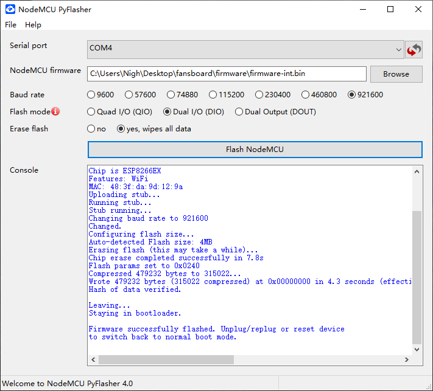

此时，可以选择拔插一下USB连线或者是按下模块上的RST按钮，强制使得模块重启。

### 3. 上传脚本

因为上传脚本是通过串口进行，强烈建议使用如下操作流程，以避免脚本上传被模块的`print`信息干扰而导致失败的情况。

1. 枚举出文件后，删除`init.lua`
2. 重启模块
3. 逐个上传脚本
4. 上传`init.lua`
5. 重启模块

因为`lua`虚拟机启动后会直接尝试执行`init.lua`，我们将其删除后可以使得程序停止，这样就不会干扰到我们上传脚本的进程了。

如果在烧录固件时选择了擦除所有数据，则可以直接进行上传脚本的操作。保险起见，仍然建议最后上传`init.lua`文件。

此处在windows环境下说明使用`ESPlorer`上传脚本的方法。

首先打开软件。

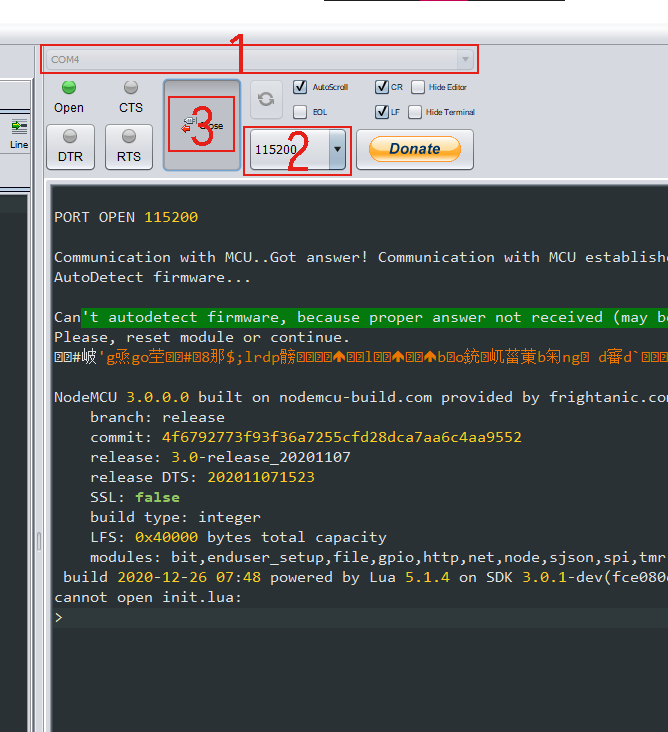

1. 设置正确的串口号。
2. 设置波特率为`115200`，这是模块上电的默认通信速率。
3. 点击按钮打开串口。

如果模块正常启动，则会在串口输出的最后看到`cannot open init.lua`的字样。否则，请按模块上的`RST`按钮重启。

然后编辑脚本文件，在`wifi.lua`文件中，需要填入你的`wifi`名称和密码。在`application.lua`文件中，修改最前面的`uid=`为你需要监控粉丝数量的B站账号的UID。

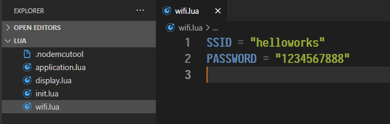

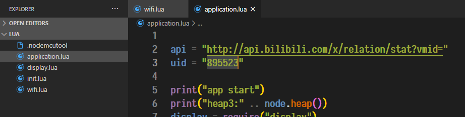

你可以使用任意工具来编辑`lua`文件，`windows`自带的记事本也可以。修改后记得保存。

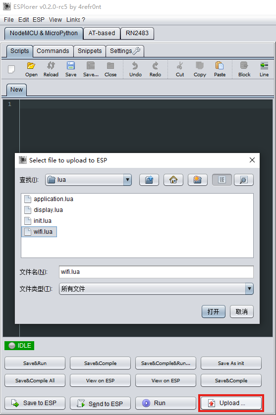

点击`upload`按钮，逐个选择脚本文件进行上传。

上传成功在右侧的窗口会有`Success`字样的显示。

所有脚本都上传完成后，按下模块的`RST`按钮重启。

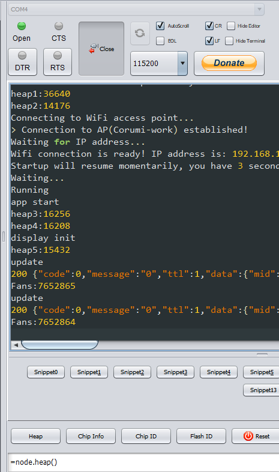

能够看到模块开始正常输出信息，并且显示板也能够开始正常显示粉丝数量。

在脚本下载完成后，即可通过显示板上的`type-c`接口供电运行，此接口朝向后方，方便部署时隐藏线缆。

## 社区

- QQ群-1群：`177238886`
- 井盖群：[https://jgchat.net/i/FXVivStG](https://jgchat.net/i/FXVivStG)
