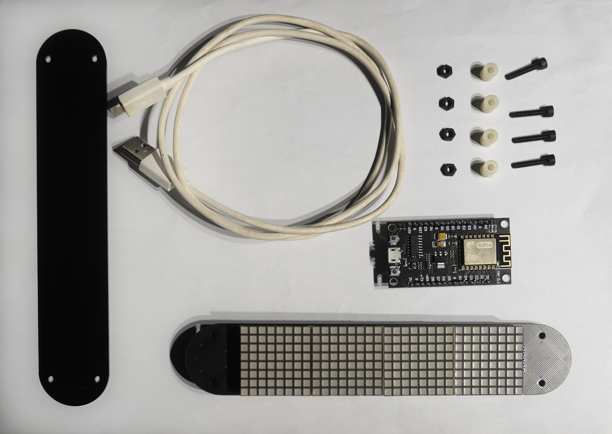

# Fans board

开源粉丝面板

- 【购买链接】https://item.taobao.com/item.htm?id=636602441363
- 【Github托管】https://github.com/HelloWorksGroup/FansBoard
- 【Gitee托管】https://gitee.com/xianii/fans-board

## 总览

`Fans board` 开源粉丝面板是一个用于网络数据实时显示的硬件。
它可以用来实时显示粉丝数，播放数，天气，股价等动态变化的信息。

## 应用

目前此项目中已经包含的应用如下：

- [粉丝面板](apps/fans-board)
- [经典时钟](apps/clock)
- [光照测试](apps/als-test)
- [新作播放](apps/new-play-count)

## 使用说明

本套装包含一个`nodeMCU v3`模块和一个四联装`8x8`点阵驱动显示板。模块与显示板通过`2.54mm`排针连接。

注意在连接时按照板上丝印提示，模块的USB口应当朝外，否则可能会损坏模块或驱动板。

### 0. 环境准备

### 1. 连接设备

### 2. 烧录固件

### 3. 上传脚本

## 社区

- QQ群-1群：`177238886`

## 赞助(Sponsor)

